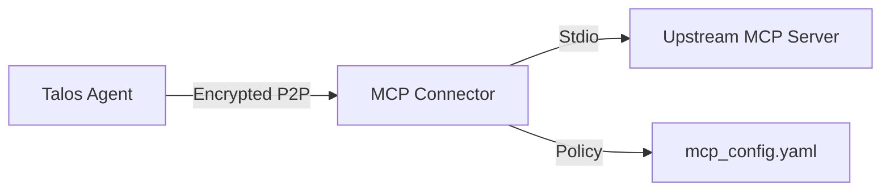

# Generic MCP Connector

> **Secure Bridge for MCP Servers**

This product allows Talos Agents to connect to standard Model Context Protocol (MCP) servers (like Git, SQLite, Ollama) while enforcing strict capability-based access control.

## Architecture



## Features

- **Universal Bridge**: Works with any Stdio-based MCP server.
- **Policy Enforcement**: `require_capability: true` blocks unauthorized tool use.
- **Zero-Code**: Configuration via YAML.

## Development

1. **Install Dependencies**:
```bash
python3 -m venv venv
source venv/bin/activate
pip install -r requirements.txt
```

2. **Run Tests**:
```bash
# Install Hooks
./scripts/install_hooks.sh

# Run Manually
pytest
```

3. **Run Connector**:
```bash
python connector.py
```
