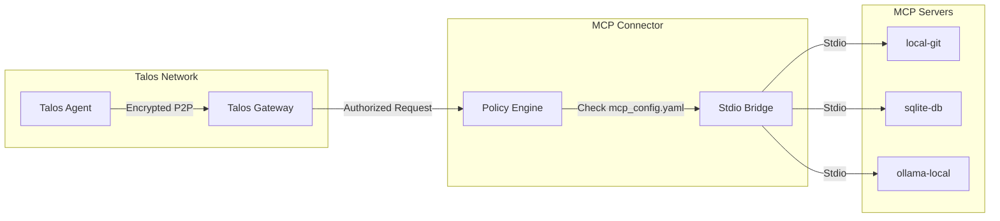

# Talos MCP Connector

> **Secure Bridge for Model Context Protocol Servers**

[](https://www.python.org/downloads/)
[](https://opensource.org/licenses/MIT)

## Abstract

The Talos MCP Connector enables Talos Agents to securely connect to standard Model Context Protocol (MCP) servers while enforcing capability-based access control. It acts as a zero-code bridge that requires only YAML configuration.

---

## Features

| Feature | Description |
|---------|-------------|
| **Universal Bridge** | Works with any Stdio-based MCP server (Git, SQLite, Ollama, etc.) |
| **Policy Enforcement** | `require_capability: true` blocks unauthorized tool use |
| **Zero-Code Setup** | Pure YAML configuration via `mcp_config.yaml` |
| **Audit Logging** | All tool invocations logged to blockchain |
| **Capability Scoping** | Restrict tools/methods per capability |

---

## Architecture



---

## Configuration

### mcp_config.yaml

```yaml
servers:
  local-git:
    command: "npx"
    args: ["-y", "@anthropic/mcp-server-git"]
    env:
      GIT_REPO_PATH: "./repo"
    require_capability: true
    
  sqlite-db:
    command: "npx"
    args: ["-y", "@anthropic/mcp-server-sqlite", "--db-path", "./my.db"]
    require_capability: true
    
  ollama-local:
    command: "python3"
    args: ["-m", "mcp_server_ollama"]
    env:
      OLLAMA_MODEL: "llama3.2"
    require_capability: true
```

### Capability Scoping

Filter tools by name pattern:

```yaml
servers:
  local-git:
    command: "npx"
    args: ["-y", "@anthropic/mcp-server-git"]
    capabilities:
      - "git:*"      # All git tools
      - "!git:push"  # Except push (deny)
```

---

## Quick Start

```bash
# Create virtual environment
python3 -m venv venv
source venv/bin/activate

# Install dependencies
pip install -r requirements.txt

# Run connector
python connector.py
```

---

## Development

```bash
# Install git hooks
./scripts/install_hooks.sh

# Run tests
make test

# Lint
make lint
```

---

## Audit Trail

All tool invocations are logged to the blockchain:

```json
{
  "type": "mcp_request",
  "tool": "local-git",
  "method": "git_status",
  "sender": "agent_abc123...",
  "hash": "sha256:...",
  "timestamp": 1704067200
}
```

---

## Security Considerations

| Threat | Mitigation |
|--------|------------|
| Unauthorized tool access | Capability-based authorization |
| Malicious server commands | Whitelist via `mcp_config.yaml` |
| Data exfiltration | Scope restrictions on tool methods |
| Replay attacks | Nonce validation + blockchain ordering |

---

## Related Documentation

- [MCP Cookbook](https://github.com/talosprotocol/talos/wiki/MCP-Cookbook)
- [Agent Capabilities](https://github.com/talosprotocol/talos/wiki/Agent-Capabilities)
- [MCP Integration](https://github.com/talosprotocol/talos/wiki/MCP-Integration)

---

## License

MIT License - See [LICENSE](LICENSE)
