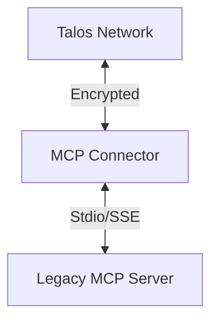

# Talos MCP Connector

**Repo Role**: Reference implementation of a bridging connector between Talos and existing MCP servers.

## Abstract

The Talos MCP Connector allows standard MCP servers (which speak JSON-RPC over Stdio/SSE) to join the Talos Network without code modification. It acts as a sidecar proxy, wrapping the local MCP server in a secure Double Ratchet tunnel.

## Introduction

Millions of existing tools natively speak MCP. Rewriting them for Talos is impractical. The Connector runs alongside these tools, handling all cryptographic complexity and presenting a standard MCP interface to the local process.

## System Architecture



## Technical Design

### Modules

- **transport**: Stdio/SSE handling.
- **tunnel**: Talos secure session management.

### Data Formats

- **Config**: JSON configuration for server command/args.

## Evaluation

Evaluation: N/A for this repo.

## Usage

### Quickstart

```bash
./talos-connector -- server_config.json
```

## Operational Interface

- `make test`: Run tests.
- `scripts/test.sh`: CI entrypoint.

## Security Considerations

- **Threat Model**: Compromise of the local machine.
- **Guarantees**:
  - **Local Binding**: Only accepts connections from localhost (if configured).

## References

1.  [Model Context Protocol](https://github.com/modelcontextprotocol)
2.  [Talos Wiki](https://github.com/talosprotocol/talos/wiki)
3.  [MCP Integration](https://github.com/talosprotocol/talos/wiki/MCP-Integration)

## License

Licensed under the Apache License 2.0. See [LICENSE](LICENSE).
