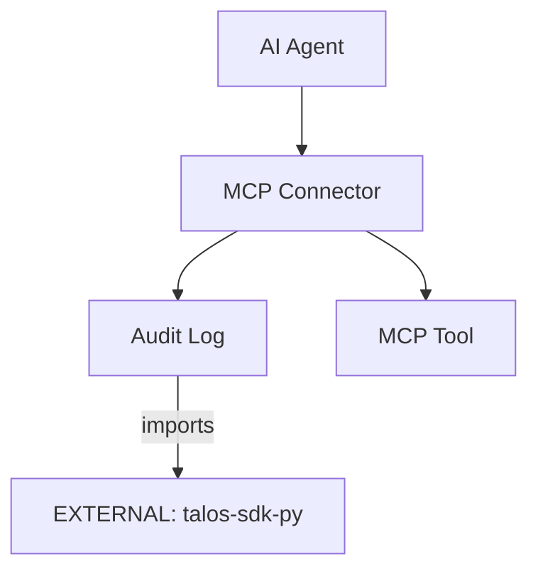

# talos-mcp-connector Architecture

## Overview
`talos-mcp-connector` is the secure bridge for AI Agents to access MCP-compatible tools over the Talos network.

## Internal Components

| Component | Purpose |
|-----------|---------|
| `main.py` | Connector entry point |
| `bootstrap.py` | DI container setup |
| `audit.py` | Audit logging for MCP calls |

## External Dependencies

| Dependency | Type | Usage |
|------------|------|-------|
| `[EXTERNAL]` talos-sdk-py | PyPI | Ports, Adapters, DI container |
| `[EXTERNAL]` talos-contracts | PyPI | Event schemas |
| `[EXTERNAL]` MCP Protocol | Spec | JSON-RPC message format |

## Supported Connectors

| Connector | Purpose |
|-----------|---------|
| Filesystem | File operations |
| SQLite | Database queries |
| Ollama | Local LLM access |

## Boundary Rules
- ✅ All MCP calls logged via SDK audit port
- ✅ Use contracts for cursor derivation
- ❌ No direct tool access without audit

## Data Flow

