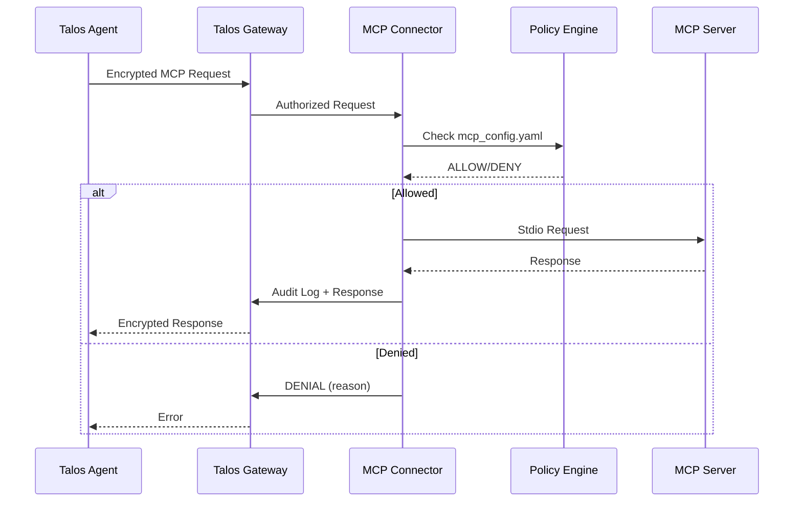
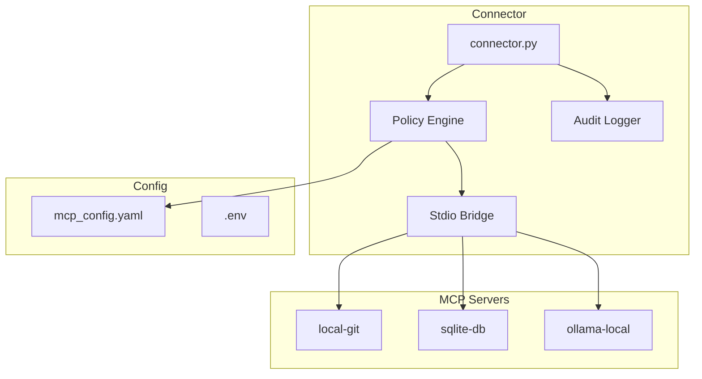

# Architecture

## Overview

The MCP Connector acts as a secure bridge between Talos Agents and standard MCP servers.

## Data Flow

## Components

## Capability Enforcement

| Check | Description |
|-------|-------------|
| `require_capability` | Require valid capability token |
| Scope matching | Tool/method must match capability scope |
| Expiration | Capability must not be expired |
| Revocation | Capability must not be revoked |
